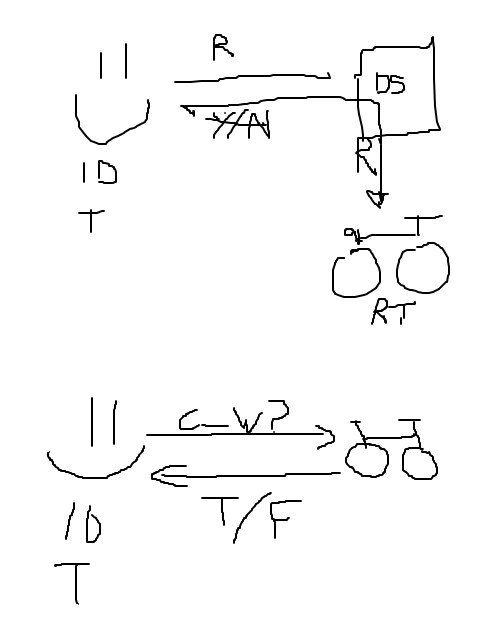

# Boris Bikes

This is a project to emulate a Santander Cycle system in Ruby.

## This project will help us to reach the following learning objectives
- Being able to TDD anything
- Programming fluently
- Ability to debug anything

## User stories and domain model

Objects | Messages
---------|----------
 Person | B1 
 Docking station | release_bike 
 Bike | check_bike_working? 

 Diagram:
 