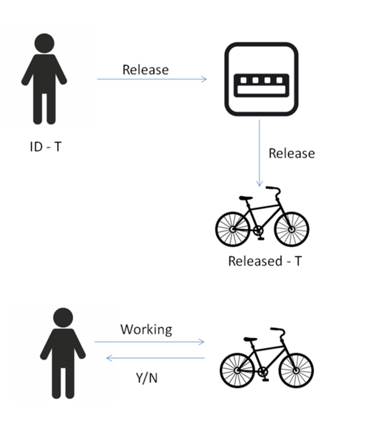

# Boris Bikes

This is a project to emulate a Santander Cycle system in Ruby.

## This project will help us to reach the following learning objectives
- Being able to TDD anything
- Programming fluently
- Ability to debug anything

## User stories and domain model

User stories:

As a person,
So that I can use a bike,
I'd like a docking station to release a bike.

As a person,
So that I can use a good bike,
I'd like to see if a bike is working


Objects | Messages
---------|----------
 Person | B1 
 Docking station | release_bike 
 Bike | check_bike_working? 

 Diagram:

 
 
 ## Errors
 
 ```
NameError: uninitialized constant DockingStation
    from (irb):2
    from /home/ec2-user/.rvm/rubies/ruby-2.6.3/bin/irb:23:in `<main>'
```

irb line 2 states : 
```
docking_station = DockingStation.new
```
This is a problem because the constant 'DockingStation' does not yet exist, or in code speak it has not been initialized.

We could solve this error by creating a constant called 'DockingStation'.